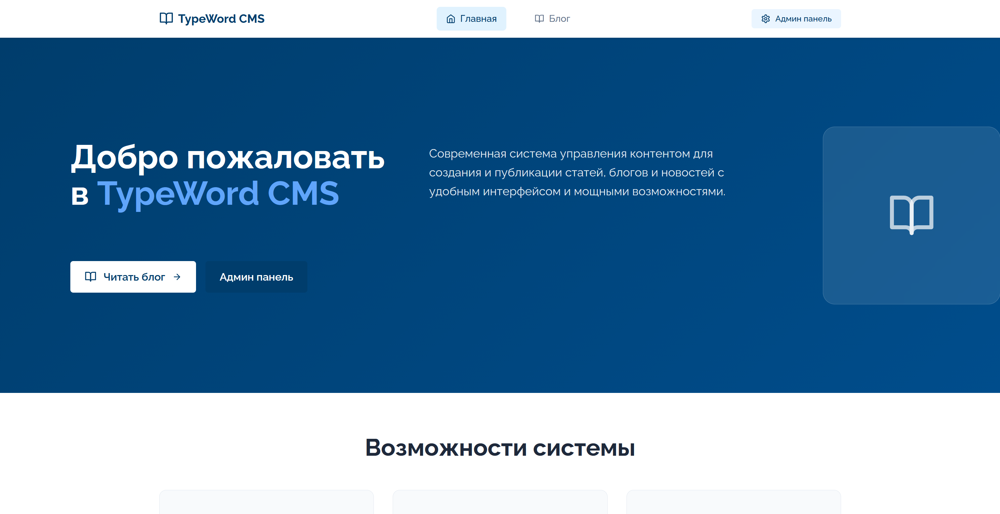
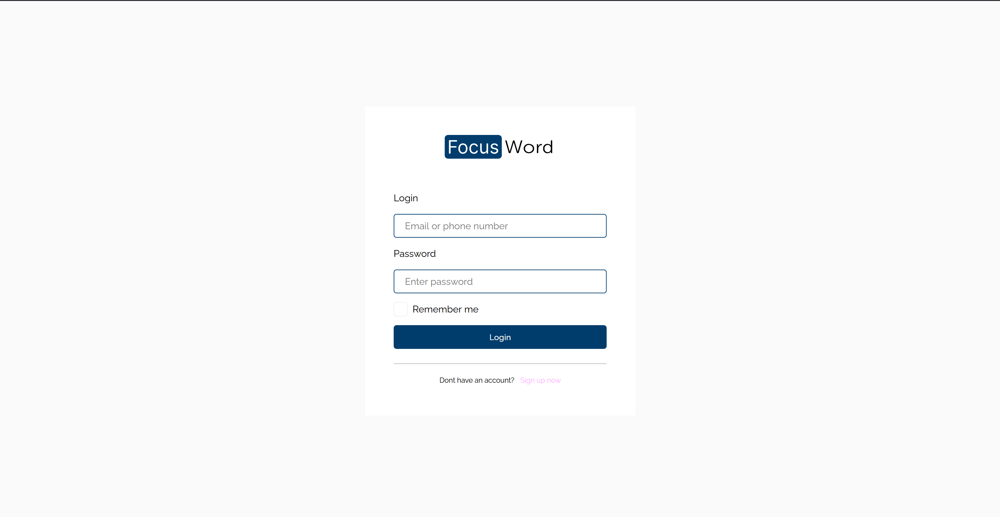
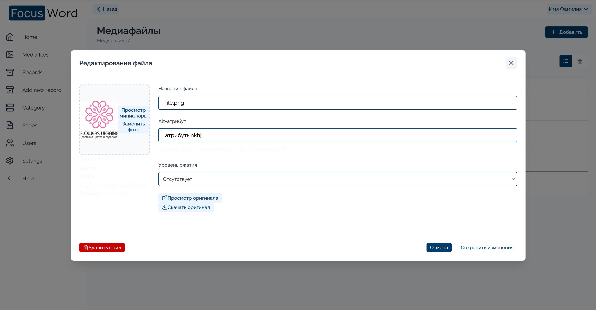
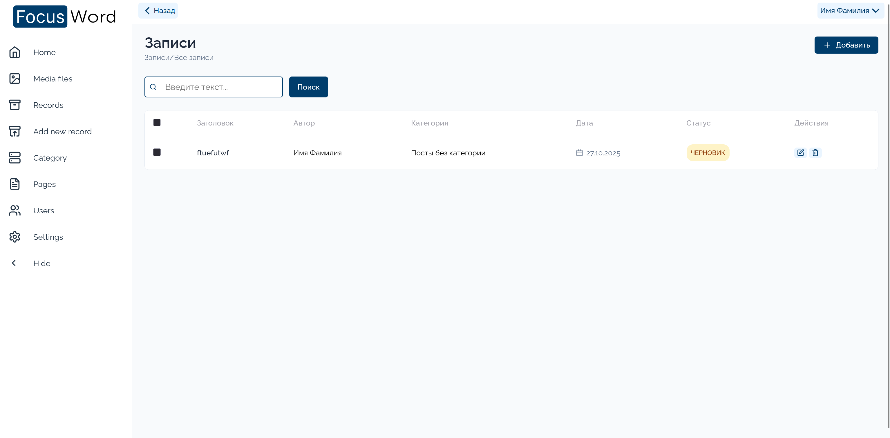

# FocusWord

[](https://opensource.org/licenses/MIT)
[](https://github.com/Flycom-os/FocusWord/actions/workflows/ci.yml)


FocusWord is a modern, open-source content management system (CMS) based on Next.js 14, React 18, and TypeScript. The project is inspired by the flexibility of WordPress, but focuses on ease of development using modern tools and practices.

We welcome contributors—if you'd like to help (with fixes, new features, or bug reports), you're welcome! Below is a brief guide to getting started, the architecture, and how to contribute.




## Key Features

- Frontend: Next.js 14 (App Router), React 18, TypeScript
- Backend: NestJS + Sequelize (REST API), JWT authentication
- Docker manifests for local development
- Validation: Zod / class-validator (frontend and backend)
- State and Cache Management: React Query (optional)

## Quick Start (Local)

1. Clone the repository:

```bash
git clone https://github.com/Flycom-os/FocusWord.git
cd FocusWord
```

2. Run the backend and frontend via Docker Compose (recommended):

```bash
cd FocusWord_backend_by_TypeWord
docker-compose up --build
```

3. For frontend development (Next.js) separately:

```bash
cd FocusWord_client_by_TypeWord
npm install
npm run dev
```

4. Scripts and settings are described in the corresponding `package.json` in the subprojects.

> Environment variables are stored in `.env` / `.env.local` (see `FocusWord_backend_by_TypeWord/.env.example` if present).

## Architecture (briefly)

- `FocusWord_backend_by_TypeWord` folder — NestJS application (API, models, migrations).
- `FocusWord_client_by_TypeWord` folder — Next.js application (admin and public parts).
- Docker-compose files for local development and the production profile.

## Contributing

We welcome contributors—any contribution is helpful:

- Open an issue for bugs and suggestions.
- Fork the project, creating a branch such as `feature/your-feature` or `fix/issue-xxx`.
- Submit a PR to the `developer` branch (or specify the branch in the PR description).
- Follow the existing coding style; the project uses TypeScript and linters—run `npm run lint` before submitting a PR.

A simple workflow template:

```bash
git checkout -b feature/awesome-change
# code
git commit -am "feat: add ..."
git push origin feature/awesome-change
# create PR
```

## Notes for JetBrains users (IDEA, WebStorm, Rider)

If you use JetBrains IDEs, here are some notes to help you get started quickly:

- Open the project root folder (`FocusWord`) as a project in the IDE.
- Install plugins: `Node.js`, `ESLint`, `Prettier`, and optionally `Docker`/`Docker Compose`.
- Set up Run/Debug configuration:
- For the frontend, use `npm run dev` in `FocusWord_client_by_TypeWord`.
- For the backend, use `npm run start:dev` or Docker-compose.
- Specify `.env` files in the environment configuration (Run Config) or add them to `.env.local` for Next.js.
- If you need to work with a database, connect to the Docker container (or local database) using Database tools in the IDE.

## API and Contract

The backend provides a REST API (in the `FocusWord_backend_by_TypeWord/src/files` folder — controllers and DTOs for working with files). Example routes:

- `POST /api/files/new_file` — upload a new file (multipart/form-data)
- `PATCH /api/files/update` — update file metadata (JSON)
- `GET /api/files/search/:page/:per_page` — file search and pagination

## License

The project is licensed under the license specified in the `LICENSE` file in the root of the repository — please check it before distributing.
