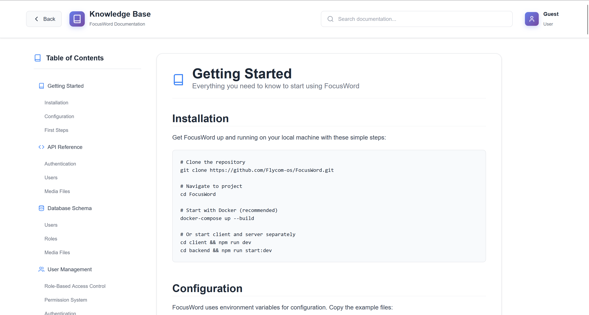
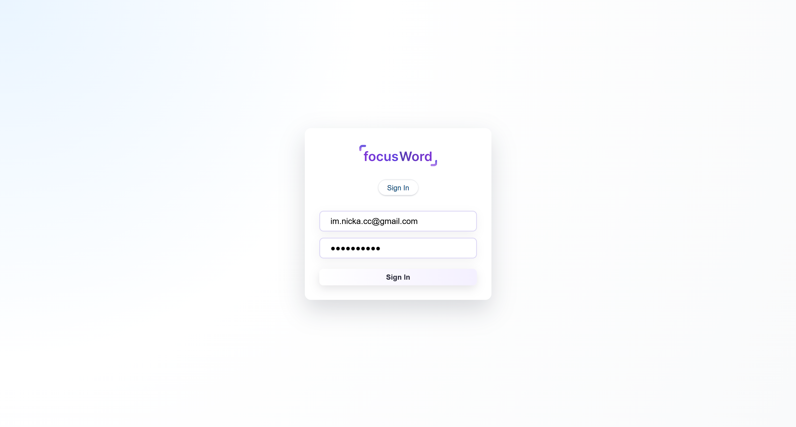
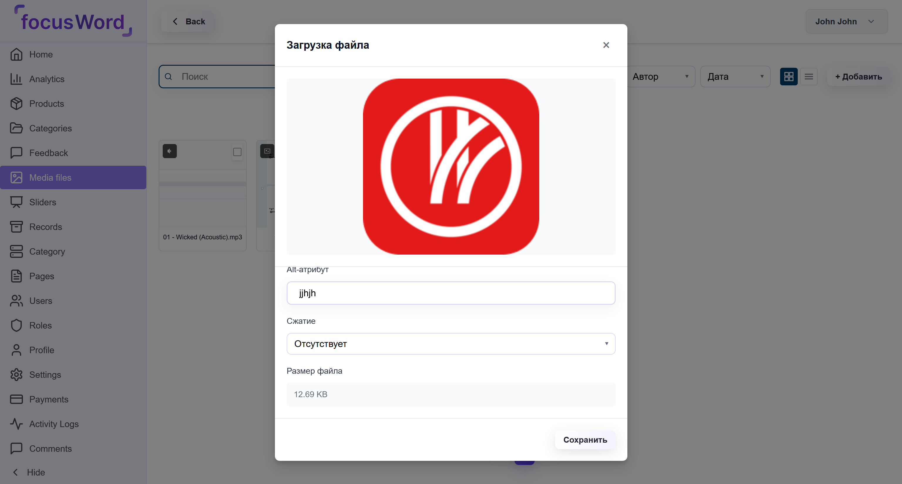
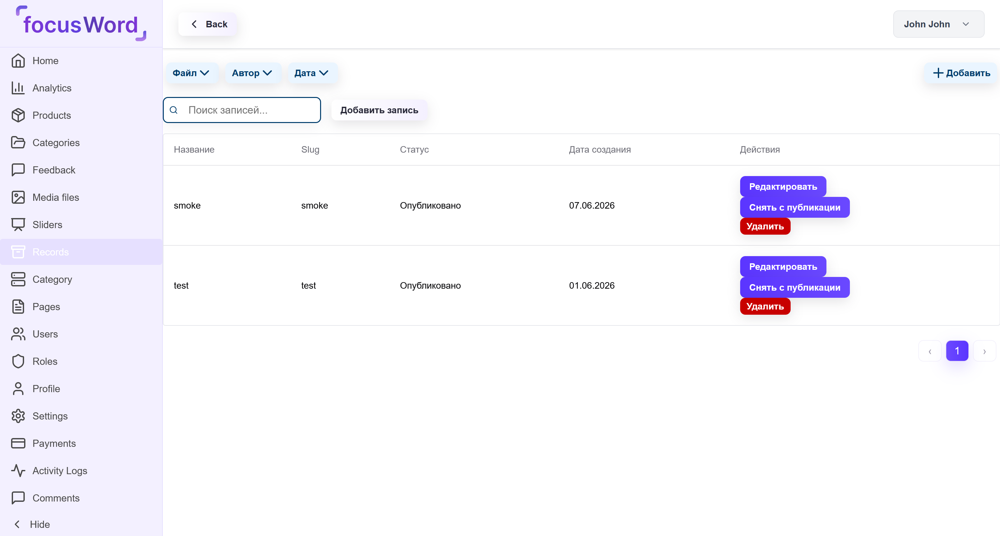

# FocusWord

[](https://opensource.org/licenses/MIT)
[](https://github.com/Flycom-os/FocusWord/actions/workflows/ci.yml)



FocusWord is a modern, open-source content management system (CMS) built with Next.js 14, React 18, and TypeScript. Inspired by the flexibility of WordPress, FocusWord is designed from the ground up to offer an exceptional developer experience using a modern, scalable technology stack.

Whether you're building a simple blog, a corporate website, or a complex dynamic application, FocusWord provides a robust API, dynamic analytics, built-in email support, and an intuitive dashboard to manage your content effectively.

We welcome contributors! If you'd like to help with bug fixes, new features, or documentation, you are more than welcome. Below is a brief guide to getting started, the architecture, and how to contribute.





## Key Features

- **Frontend:** Next.js 14 (App Router), React 18, TypeScript, robust UI components
- **Backend:** NestJS, Prisma ORM, PostgreSQL (REST API), JWT authentication
- **Analytics:** Granular tracking (Pages, Articles, Records, Blog) with Excel/PDF export
- **Dynamic Dashboard:** Real-time metrics and dynamic data presentation without hardcoding
- **Docker Ready:** Built-in Docker compose configuration for seamless local development
- **Validation:** Zod / class-validator ensuring data integrity across frontend and backend

## Quick Start (Local)

1. Clone the repository:

```bash
git clone https://github.com/Flycom-os/FocusWord.git
cd FocusWord
```

2. Run the backend and frontend via Docker Compose (recommended):

```bash
cd backend
docker-compose up --build
```

3. To run the frontend (Next.js) locally without Docker:

```bash
cd client
npm install
npm run dev
```

4. To run the backend (NestJS) locally without Docker:

```bash
cd backend
npm install
npm run start:dev
```

> **Note:** Environment variables are required. Copy the `.env.example` file to `.env` in both the `/backend` and `/client` directories and adjust the values (e.g., SMTP credentials for mailer, database URLs, etc.).

## Architecture Overview

- **`/backend`** folder — The NestJS application. It handles REST APIs, JWT authentication, email services, and database operations using Prisma.
- **`/client`** folder — The Next.js application. It contains the public-facing pages and the comprehensive admin dashboard.
- **`/documentation`** folder — Extended project documentation and wikis.

## Contributing

We value all contributions—whether it's code, documentation, or design:

- **Issues:** Open an issue for bug reports or feature requests.
- **Branching:** Fork the repository and create a branch (e.g., `feature/your-feature` or `fix/issue-xxx`).
- **Pull Requests:** Submit PRs to the `developer` branch.
- **Standards:** The project uses TypeScript and linters. Please run `npm run lint` and ensure there are no build errors before submitting.

Simple contribution workflow:

```bash
git checkout -b feature/awesome-change
# make your changes
git commit -am "feat: add awesome feature"
git push origin feature/awesome-change
# create a Pull Request on GitHub
```

## IDE Setup (JetBrains, VS Code)

If you are using an IDE like WebStorm, IntelliJ IDEA, or VS Code, follow these tips:

- Open the root `FocusWord` folder as the main project directory.
- Ensure plugins for `Node.js`, `TypeScript`, `ESLint`, and `Prettier` are installed.
- Configure Run/Debug profiles:
  - Frontend: `npm run dev` in the `/client` directory.
  - Backend: `npm run start:dev` in the `/backend` directory.
- Properly configure `.env` files in both directories so the IDE can resolve environment variables.

## API Structure

The backend provides a structured REST API configured with Swagger. Key endpoints include domains such as users, roles, analytics, articles, and blog posts:

- **Users/Roles:** `GET /user/all`, `GET /roles`
- **Analytics:** `GET /analytics`, `GET /analytics/stats` for robust dashboard insights.
- **Content:** Full CRUD support for `articles`, `blog`, `pages`, and `records`.

## License

This project is open-source and licensed under the MIT License. Please see the `LICENSE` file for more details.
